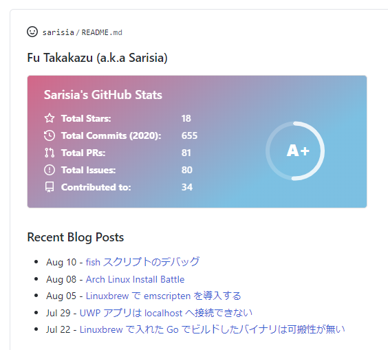

こんにちは.

皆様, [GitHub Profile README](https://docs.github.com/en/github/setting-up-and-managing-your-github-profile/managing-your-profile-readme) は使っていますか？ GitHub のプロフィールページに任意の Markdown 文章を表示できるアレです.

私も最初は名前とリンクだけを適当に貼ったページを用意していましたが, [GitHub Readme Stats](https://github.com/anuraghazra/github-readme-stats) を見つけてから, README のカスタマイズが楽しくなってしまいました.

# ブログの新着記事を表示したい

本題です.

GitHub で, 生やした草やリポジトリに加え, README でアピールできるようになった今, プロフィールを見に来てくださった人に最新のブログ記事や Qiita 記事更新をアピールしたくないですか？

というわけで, RSS フィードから最新記事を取得して Markdown を自動更新する GitHub Actions アクションを作りました[^1]:

[Actions Readme Feed - GitHub Marketplace](https://github.com/marketplace/actions/actions-readme-feed)

# 使い方

基本的にはマーケットプレイスのページに書いてある通りです.

`README.md` の記事一覧を挿入したい箇所にフラグコメントを突っ込みます:

```markdown
### Recent Blog Posts
<!-- feed start -->
<!-- feed end -->
```

`.github/workflows/` 以下のワークフローにステップを追加します. コミットまではやらないので気合で頑張ります. [この辺](https://github.com/marketplace/actions/add-commit)のアクションを使うと楽かもしれません...:

```yaml
steps:
  - uses: actions/checkout@v2
  - uses: sarisia/actions-readme-feed@v1
    with:
      url: 'https://note.sarisia.cc/index.xml'
      file: 'README.md'
  - run: |
      git config --global user.name "${{ github.actor }}"
      git config --global user.email "${{ github.actor }}@users.noreply.github.com"
      git add .
      git commit -m "docs: update feed" || true
      git push
```

プロフィールページにブログの投稿が追加されます！



## 応用編

### Qiita の表示

`https://qiita.com/[username]/feed` でRSSフィードが取れるので[^2], これを `url` として渡します:

```yaml
- uses: sarisia/actions-readme-feed@v1
  with:
    url: 'https://qiita.com/sarisia/feed'
    file: 'README.md'
```

### 自動更新

Workflow を `schedule` で回してあげれば自動更新できます:

```yaml
on:
  schedule:
    - cron: '0 */6 * * *'

jobs:
  readme:
    runs-on: ubuntu-latest
    steps:
      - uses: actions/checkout@v2
      - uses: sarisia/actions-readme-feed@v1
```

# まとめ

出力のテンプレート機能やフラグ変更など, もっと高度なカスタマイズも出来るようになっているので, [リポジトリページ](https://github.com/sarisia/actions-readme-feed)も参考に是非使ってみてください！

[^1]: 実は一週間先を越されていた: [README the RSS](https://github.com/marketplace/actions/readme-the-rss)  
が, 多分カスタマイズできるオプションはこっちのほうが多いはず…

[^2]: 公式のドキュメントが無いのでいつか急に消滅するかもしれません