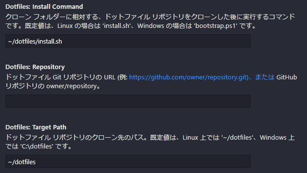

2020/10/13 追記: Codespaces 上で dotfiles の挙動が変更できることを追記

[GitHub Codespaces](https://github.com/features/codespaces) は, ブラウザから利用できる Visual Studio Code をワンクリックで起動してくれる最高のクラウド開発環境サービスです. 現在はプライベートベータ版が提供されています.

Codespaces は, 開発環境のカスタマイズの自由度が非常に高いことが特徴です. devcontainer を用いた環境定義ができる他, dotfiles リポジトリの自動適用や VSCode Settings Sync の設定など, コンテナ環境からエディタの設定まで, ほぼすべてをカスタマイズすることができます.

一方で, Codespaces は, そのカスタマイズの自由度の高さ故に, 何も考えずに利用すると, 意図しない設定が適用されて Codespaces が起動しなかったり挙動がおかしくなったりします.

今回は, 私が Codespaces ベータ版を一ヶ月ほど使ってきた中で失敗した事例と, カスタマイズの際に考えるべきことを紹介します.

# 起動が遅い

Codespaces は, 起動時に devcontainer の設定ファイル (`devcontainer.json`) 内で指定された Docker イメージを pull, または `Dockerfile` をビルドします. これは, 開発環境に任意の Docker イメージを利用できるので大きな魅力ですが, コンテナ作成の度にイメージを pull しに行くので, **起動にかかる時間が大幅に伸びます.** デフォルトのイメージ ( devcontainer なし) での起動が1分かからない程度であるのに対し, カスタムの Docker イメージを用いると, イメージによっては起動に3分以上かかりました.

## 対処法: キャッシュされたイメージを使う

Codespaces のホストは,  [microsoft/vscode-dev-containers](https://github.com/microsoft/vscode-dev-containers) に用意されている devcontainer 向け Docker イメージをローカルに持っているため, これらのイメージを用いて devcontainer を構成することで Codespaces 作成時のイメージの pull を避けることができ, 起動時間を短縮できます.

例えば, GitHub Codespaces では, リポジトリに devcontainer が設定されていない場合は, デフォルトのイメージとして [mcr.microsoft.com/vscode/devcontainers/universal:linux](https://github.com/microsoft/vscode-dev-containers/tree/master/containers/codespaces-linux) イメージを利用しますが, これは Codespaces のホストがローカルにイメージを持っているため[^1], イメージの pull を行わず[^2], 比較的高速に起動できます.

## 高速に起動できる devcontainer の簡単な設定方法

Codespaces で高速に起動できる devcontainer を追加するには, ローカルの VSCode に `Remote - Containers` (`ms-vscode-remote.remote-containers`) 拡張をインストールした上で, Command Palette → `Remote-Containers: Add Development Container Configuration Files...` コマンドを利用するのが簡単です. 全てを調査したわけではありませんが, 大体のイメージは Codespaces ホストがイメージを持っているようです.

前述のコマンドで追加できる devcontainer の定義は [GitHub で公開されています](https://github.com/microsoft/vscode-dev-containers/tree/master/containers). また, 一部 GitHub Codespaces で動作しないイメージもあるので, [CODESPACES.md](https://github.com/microsoft/vscode-dev-containers/blob/master/containers/CODESPACES.md) も参照してください.

# VSCode の設定が変

Codespaces ではデフォルトで **VSCode Settings Syncが有効[^3]** になっているため, 他環境の意図しない設定が同期される場合があります.

これは, 殆どの設定は無害な一方で, 例えばVSCode内のシェル起動時の引数を設定する `terminal.integrated.shellArgs.linux` や, Go バイナリの位置を設定する `go.alternateTools` など, 環境依存の設定が同期されると, Codespaces 上のシェルの設定が狂ったり, コンテナ上のツールチェインを検出できなくなったりします.

## 対処法: 同期から除外 / スコープの変更

Settings Sync は Codespaces 上で無効にできず, 新しい Codespaces は常に同期が有効な状態で作成されます. したがって, [公式ドキュメント](https://code.visualstudio.com/docs/editor/settings-sync#_configuring-synced-data)を参考に, 特定の設定を同期から除外, もしくは `machine` や `workspace` などの適切なスコープに設定する必要があります.

# シェルの設定が変

Codespaces は, デフォルトで **ユーザの `dotfiles` リポジトリを自動適用** するため, コンテナ上で `dotfiles` が適切に設定されない場合があります.

[公式ドキュメント](https://docs.github.com/en/free-pro-team@latest/github/developing-online-with-codespaces/personalizing-codespaces-for-your-account)に説明がある通り, Codespaces は GitHub ユーザが `dotfiles` という名前のパブリックリポジトリを持っていた場合, 以下の処理を行います:

- 特定のファイル名のインストールスクリプトが見つかった場合, それを実行する:

    ```jsx
    install.sh
    install
    bootstrap.sh
    bootstrap
    setup.sh
    setup
    ```

- インストールスクリプトが存在しない場合, `.` から始まるファイル, フォルダに対するシンボリックリンクをホームディレクトリに張る.

もし, 今までに `dotfiles` を GitHub 上で管理していた場合, それらは意図せず Codespaces の初期化に利用される場合があります.

## 対処法1. Codespaces 上で設定する

2020/10/13追記

起動した Codespaces 上の VSCode の設定に, Dotfiles 関連の設定があるようなので, それを使うと
制御できるかもしれません (試していません).



追記終

## 対処法2. : `$CODESPACES` 環境変数を用いる

最も手っ取り早い方法はインストールスクリプトの名前を変更してしまうことですが, 以前より用いている物にあまり手を入れたくありません. この場合, インストールスクリプトの中で `$CODESPACES` 環境変数によって動作を変更することができます.

Codespaces は, コンテナ起動時に環境変数 `CODESPACES=true` を設定してくれます. これを利用して, インストールスクリプト内で:

```bash
if [[ "$CODESPACES" ==  true ]]; then
  exit 0
fi
```

等とすれば, スクリプトが Codespaces 内で実行された場合に何もせず終了させることができます.

# まとめ

Codespaces によってブラウザ上で完全な VSCode が動作するようになり, 場所や端末を選ばないコーディングが可能になりつつありますが, まだまだ起動にかかる時間が長かったり, 設定の罠が多かったりと, 惜しい印象です.

Visual Studio Codespaces の GitHub Codespaces への[統合スケジュール](https://devblogs.microsoft.com/visualstudio/visual-studio-codespaces-is-consolidating-into-github-codespaces/)を見ると, 11月には正式リリースされそうな雰囲気なので, 気になる方は今のうちに devcontainer や VSCode の設定を見直してリリースに備えましょう!

[^1]: ホストがどのイメージをローカルに持っているかは, ホストの docker に対して `docker images` を叩くことで確認できます. ただし, コンテナ作成後にホストのイメージを順次削除するように設定されているらしく, しばらくするとローカルのイメージはすべて削除されてしまいます. 削除されたことは `docker events --filter type=image` 等で確認できます.

[^2]: Codespaces のビルドログで確認できます. ビルドログは, Command Palette → `Codespaces: View Creation Log` で開くことができます.

[^3]: 公式ドキュメントではこの仕様に言及がありませんが, 私の環境では, ローカルの Settings Sync に GitHub アカウントにログインしていると Codespaces 上に設定が同期されました.