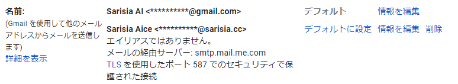
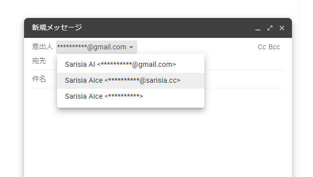
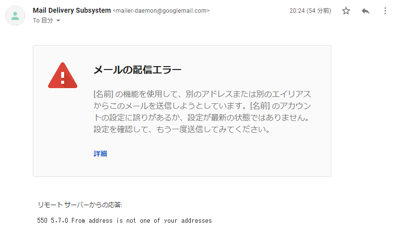

こんにちは.

最近, Apple One 契約者の iCloud+ 自動アップグレードが始まり[^1],
誰でも iCloud メールのカスタムメールドメイン[^2]が使えるようになったみたいです.
カスタムドメインの敷居が下がっていいですね.

さて, 「メールにカスタムドメインは使いたいけど, iCloud メールは嫌だ...」 という方,
いらっしゃるのでは無いでしょうか. 私もその一人です. iCloud メールのブラウザ版,
お世辞にも使いやすいとは言えませんし (個人の感想です), やはり慣れ親しんだ Gmail を
離れたくありません.

というわけで, なんとか Gmail から iCloud メールで設定したカスタムメールドメインの
メールを送受信できないか？と思いポチポチいじっていました. 

# TL;DR

タイトルにもある通り失敗です.

- iCloud カスタムメールドメインの受信はできる
- iCloud カスタムメールドメインのメールアドレスからの送信は Gmail 側にブロックされて
できない

# 前提

iCloud メールのカスタムメールドメイン設定が完了し, カスタムドメインのメールアドレスを
登録済みの状態を前提とします[^2].

# 受信

受信の設定は簡単です. Gmail 側から POP や IMAP で iCloud メールを取ってきたくなりますが,
iCloud は POP に対応していないし, Gmail は IMAP に対応していません.

諦めて素直に iCloud 側からメールの自動転送を設定しましょう:

iCloud.comの「メール」で自動的にメールを転送する - Apple サポート
https://support.apple.com/ja-jp/guide/icloud/mm6b1a3960/icloud 

# 送信

うまくいかなかった部分です.

iCloud が SMTP サーバの設定情報を公開しているので, これを Gmail に設定してあげれば良さそうです.

以下の手順を参考に, Gmail を設定します:

別のアドレスやエイリアスからメールを送信する - Gmail ヘルプ
https://support.google.com/mail/answer/22370?hl=ja 

iCloud のメールサーバ情報はこの辺にあります:

iCloud メールクライアント向けのメールサーバ設定 - Apple サポート (日本)
https://support.apple.com/ja-jp/HT202304

この時, iCloud SMTP サーバのユーザ名には, **オリジナルの iCloud メールアドレス**を指定する必要が
あります. iCloud に設定済みのカスタムドメインのメールアドレスは弾かれます.
正しく情報を入力すれば, カスタムドメインのメールアドレス宛に確認メールが届き, 上手く行ったように
見えます:

## でも送信できない

試しに Gmail から適当なメールを送信してみます.

Gmail の新規メッセージウィンドウから, 差出人を選択できるようになっているので, カスタムドメインの
メールアドレスを選択し, 適当に送信します:

すると, Gmail から怒られます:

## なんで？

推測になりますが, 恐らく SMTP サーバの設定時にユーザ名として入力したメールアドレスを用いて,
From アドレスがバリデーションされています.

iCloud の SMTP サーバはユーザ名としてオリジナルの iCloud メールアドレスしか受け付けてくれないので,
From アドレスとしてもオリジナルの iCloud メールアドレスしか利用できません.

# まとめ

悲しい

[^1]: [Appleの強化版クラウド「iCloud+」、自動アップグレード開始 - ITmedia NEWS](https://www.itmedia.co.jp/news/articles/2110/11/news070.html)
[^2]: [iCloud メールでカスタムメールドメインを使う - Apple サポート (日本)](https://support.apple.com/ja-jp/HT212514)
